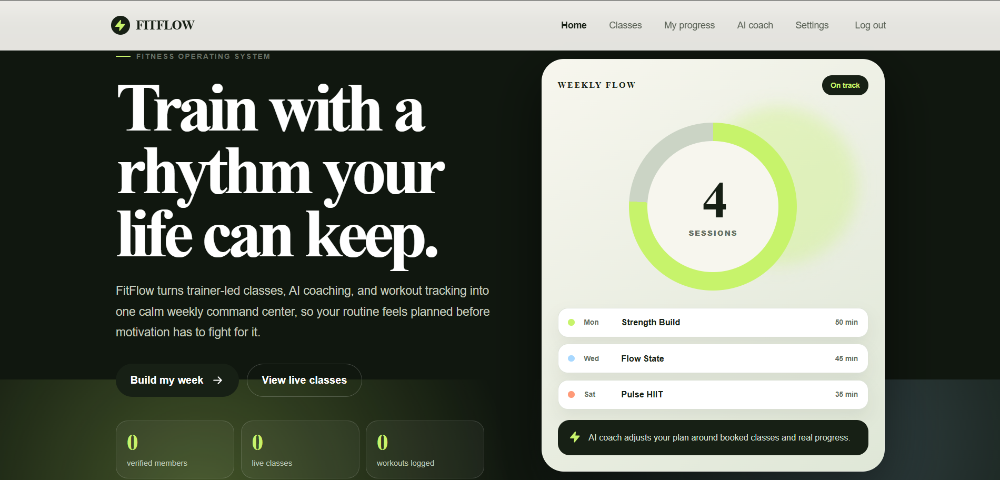
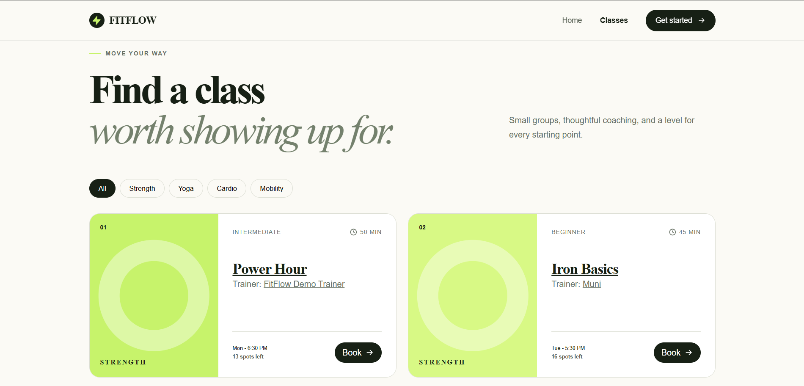
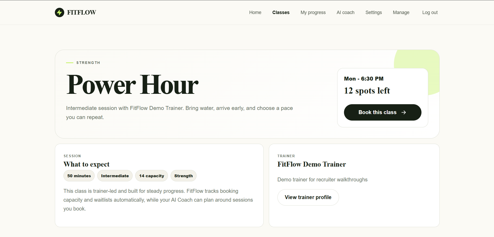
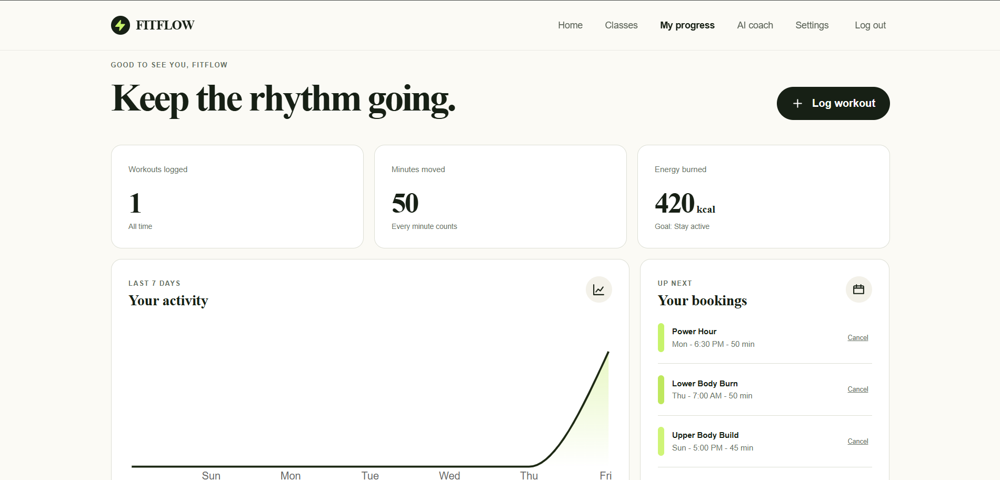
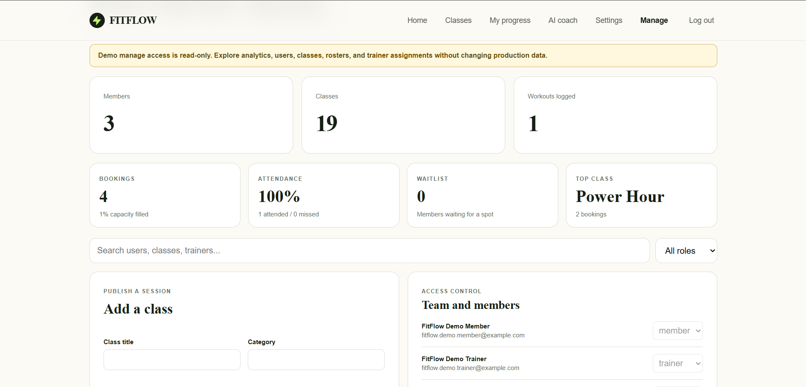

# FitFlow - MERN Fitness Consistency Platform

FitFlow is a full-stack fitness product that helps people build a routine they can sustain. Members can create an account, discover and book trainer-led classes, log workouts, and review their weekly activity.

## Live Preview

[Try FitFlow](https://fitflow-mern.onrender.com)

## Project highlights

- Real MERN product flow: signup, email OTP verification, login, dashboard, class booking, workout logging, settings, and admin/trainer operations.
- Production-minded auth: JWT sessions, bcrypt password hashing, protected routes, role-based access, verified-email guards, and production-safe OTP responses.
- Class operations that go beyond CRUD: capacity checks, atomic booking for final spots, waitlists, cancellation, trainer ownership, and admin role management.
- Trainer operations: assigned-session dashboards, booked-member rosters, waitlist visibility, and attendance/missed check-ins.
- Admin analytics for booking demand, capacity fill, attendance rate, waitlists, top classes, and trainer load.
- Public trainer profile pages with specialties, bio, certifications, and assigned classes.
- AI Coach feature with graceful fallback: OpenAI can generate adaptive plans, but the rules engine still works without an API key.
- Portfolio polish: responsive React UI, PWA metadata, CI workflow, automated tests, security headers, rate limiting, and clean project structure.

## Screenshots

### Home



### Login


### Classes



### Class Detail



### Member Dashboard



### AI Coach


### Admin Manage



## Why this project exists

Many fitness products focus on intense short-term plans. FitFlow focuses on repeatable habits: make a plan, show up, and see momentum grow. It upgrades the original static FitZone site into a real product with persistent user data.

## Features

- JWT authentication with bcrypt password hashing
- Protected member dashboard
- Filterable fitness class catalog
- Capacity-aware class booking with atomic final-spot updates
- Workout creation and deletion
- Seven-day activity visualization
- Per-user workout history and totals
- Responsive, accessible React interface
- MongoDB persistence through Mongoose
- Production build served by Express
- Adaptive AI Coach plans using goals, availability, workout history, and real classes
- Safe deterministic AI Coach fallback when no AI key is configured
- Admin and trainer role-based workspaces
- Real dated sessions, editing, cancellation, waitlists, trainer ownership, and automatic promotion
- Class detail pages with trainer context, capacity, booking, and similar classes
- Trainer attendance tracking for attended/missed member check-ins
- Admin analytics for booking demand, attendance, waitlists, and trainer workload
- Account settings for goals, training profile, trainer profile, and password updates
- Public trainer profiles and assigned class listings
- Email OTP verification, OTP password reset, and Google sign-in API support
- Stripe Checkout integration for memberships
- Automatic MET-based calorie estimates and detailed exercise/measurement models
- In-app notifications, email delivery, PWA installation, and offline frontend caching
- Helmet security headers, authentication rate limiting, and automated tests

## Tech stack

React, React Router, Recharts, Vite, Node.js, Express, MongoDB, Mongoose, JWT, and bcrypt.

Optional integrations use OpenAI, Stripe, Google Identity, and Brevo email delivery. The AI Coach remains functional without those services.

## Run locally

1. Install [Node.js](https://nodejs.org/) and MongoDB locally, or create a free MongoDB Atlas database.
2. Copy `.env.example` to `.env`.
3. Put your MongoDB connection string and a long random JWT secret in `.env`.
4. Install dependencies and start both apps:

```bash
pnpm install
pnpm dev
```

The React app opens at `http://localhost:5173`; the API runs at `http://localhost:5000`.

If you prefer npm, the equivalent commands are:

```bash
npm install
npm run dev
```

Run automated tests with `pnpm test` and create a production build with `pnpm build`.

Production-quality checks are available through `pnpm lint`, `pnpm test:coverage`, `pnpm test:e2e`, `pnpm audit --prod`, and `pnpm smoke`. See [Testing strategy](docs/TESTING.md).

Database-backed integration tests are included for signup OTP, forgot-password OTP, booking/waitlist, and admin role changes. They run only when a separate test database is configured:

```bash
INTEGRATION_MONGODB_URI=mongodb://127.0.0.1:27017/fitflow-integration pnpm test
```

GitHub Actions starts a MongoDB service automatically and sets `INTEGRATION_MONGODB_URI`, so pull requests run the integration suite instead of skipping it.

## Demo access

Create the admin account locally with:

```bash
pnpm seed:admin
```

Use the values you set in `.env` for `ADMIN_EMAIL` and `ADMIN_PASSWORD`. Admin users can open **Manage**, promote members to trainers/admins, create classes, edit classes, and cancel classes. Trainers can open **Manage** and edit only their own assigned classes.

For recruiter demos, create separate throwaway accounts instead of sharing a personal admin login:

```bash
ALLOW_DEMO_ACCOUNTS=true pnpm seed:demo
```

Set `DEMO_ADMIN_EMAIL`, `DEMO_ADMIN_PASSWORD`, `DEMO_TRAINER_EMAIL`, `DEMO_TRAINER_PASSWORD`, `DEMO_MEMBER_EMAIL`, and `DEMO_MEMBER_PASSWORD` first. Keep demo passwords out of public commits if they use real admin privileges. For portfolio sharing, prefer throwaway demo accounts and rotate the passwords after interviews.

Recommended demo setup:

| Role | Purpose |
|---|---|
| Demo admin | Shows Manage, analytics, user roles, and class operations in read-only mode |
| Demo trainer | Shows assigned sessions, roster, waitlist, and attendance marking in read-only mode |
| Demo member | Shows signup/login flow, bookings, dashboard, settings, and AI Coach |

Use non-personal email addresses for these accounts and keep the actual passwords only in Render/GitHub secrets, not in the README. Demo admin/trainer accounts are flagged as demo accounts, so risky manage actions such as role changes, class edits, class cancellation, and attendance mutations are blocked server-side.

## Optional service configuration

- `OPENAI_API_KEY` and `OPENAI_MODEL`: enables generated adaptive plans. Without them, the safe rules engine creates plans.
- `SMTP_*`: sends verification, reset, and booking emails. Brevo SMTP works with `SMTP_HOST=smtp-relay.brevo.com`, `SMTP_PORT=587` or `2525`, the Brevo SMTP login, and the Brevo SMTP key.
- `BREVO_API_KEY` and `BREVO_SENDER_EMAIL`: HTTP API email sending. Use this on Render if SMTP ports time out; it is the most reliable production OTP option.
- `STRIPE_SECRET_KEY`, `STRIPE_PRICE_ID`, and `STRIPE_WEBHOOK_SECRET`: enable hosted membership checkout and signed subscription updates. See [Production operations](docs/OPERATIONS.md).
- `GOOGLE_CLIENT_ID`: enables the verified Google token endpoint.
- `APP_URL`: the frontend origin used in email and payment return links.
- `NODE_ENV=production`: required in deployment so OTP codes are never included in API responses.

Never expose these secrets through `VITE_` variables or commit `.env`.

Create the first administrator after setting `ADMIN_EMAIL` and `ADMIN_PASSWORD` (12+ characters):

```bash
pnpm seed:admin
```

## API overview

| Method | Endpoint | Purpose |
|---|---|---|
| POST | `/api/auth/register` | Create an account |
| POST | `/api/auth/login` | Sign in |
| GET | `/api/auth/me` | Restore a session |
| PATCH | `/api/auth/settings` | Update profile, trainer profile, or password |
| POST | `/api/auth/verify-email` | Verify signup OTP |
| POST | `/api/auth/forgot-password` | Send reset OTP |
| POST | `/api/auth/verify-reset-code` | Confirm reset OTP |
| POST | `/api/auth/reset-password` | Save a new password |
| GET | `/api/classes` | List and seed classes |
| GET | `/api/classes/:id` | View class details and similar classes |
| GET | `/api/classes/stats/summary` | Public homepage stats |
| POST | `/api/classes/:id/book` | Book a class |
| GET | `/api/classes/mine/booked` | List the member's bookings |
| GET | `/api/trainers` | List public trainers |
| GET | `/api/trainers/:id` | View a trainer profile and assigned classes |
| GET/POST | `/api/workouts` | List or log workouts |
| DELETE | `/api/workouts/:id` | Remove a workout |
| GET/PATCH/DELETE | `/api/admin/classes` | Admin/trainer class operations |
| GET | `/api/admin/analytics` | Admin/trainer booking and attendance analytics |
| PATCH | `/api/admin/classes/:id/attendance/:userId` | Mark a booked member attended or missed |

## Deployment checklist

1. Push the project to GitHub.
2. Confirm GitHub Actions passes: `pnpm test` and `pnpm build`.
3. Deploy the API and frontend together on Render/Railway/Fly.io, or deploy the frontend on Vercel and the API separately.
4. Set production environment variables: `NODE_ENV=production`, `MONGODB_URI`, `JWT_SECRET`, `APP_URL`, email provider credentials, and any optional Stripe/Google/OpenAI keys.
5. Run `pnpm seed:admin` once against the production database.
6. Add screenshots to the repository after deployment: home, classes, dashboard, AI coach, settings, and admin manage screen.

## Code organization

See [Architecture](docs/ARCHITECTURE.md) for request, authentication, billing, and reliability boundaries, and [Production operations](docs/OPERATIONS.md) for deployment, monitoring, Stripe, and branch-protection configuration.

- `client/src/App.jsx`: route composition and shared authenticated page flows.
- `client/src/components/*`: shared navigation and form controls such as password visibility and OTP entry.
- `client/src/pages/Home.jsx`: portfolio-facing homepage experience.
- `client/src/pages/Auth.jsx`: login, signup, signup OTP, and forgot-password OTP flows.
- `client/src/pages/Dashboard.jsx`: member progress, bookings, workout logging, and activity chart.
- `client/src/pages/Coach.jsx`: adaptive AI Coach planning workflow.
- `client/src/pages/Settings.jsx`: profile, trainer profile, and password settings.
- `client/src/pages/Classes.jsx`: class catalog and class detail pages.
- `client/src/pages/Admin.jsx` and `client/src/pages/admin/*`: admin/trainer workspace split into analytics, people, class form, and class manager sections.
- `client/src/ui.jsx`: reusable UI primitives such as icons, stats, empty states, skeletons, and confirmation modals.
- `client/src/auth-context.jsx`: shared authenticated user context.
- `server/routes/*`: feature-focused API modules for auth, classes, trainers, workouts, coach, admin, notifications, and payments.

## Resume description

**FitFlow - Full-stack fitness consistency platform**  
Built a responsive MERN application with JWT authentication, class discovery and capacity-aware booking, personalized workout tracking, and seven-day progress visualizations. Designed REST APIs with Express and modeled user-specific data relationships with MongoDB/Mongoose.
